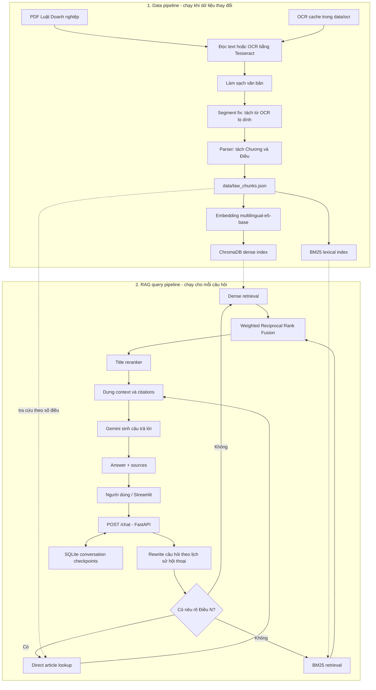

# Vietnamese Enterprise Law RAG

Hệ thống hỏi đáp Luật Doanh nghiệp Việt Nam sử dụng Retrieval-Augmented
Generation (RAG). Project xử lý tài liệu PDF/OCR, tách văn bản theo từng điều
luật, lập chỉ mục Dense và BM25, truy xuất theo hai nhánh direct lookup hoặc
hybrid retrieval, sau đó dùng Google Gemini để tạo câu trả lời có nguồn tham
khảo.

Project cung cấp:

- FastAPI backend cho API hỏi đáp;
- Streamlit frontend để chat trên trình duyệt;
- LangGraph để điều phối rewrite → retrieve → generate và lưu hội thoại;
- ChromaDB + Sentence Transformers cho semantic retrieval;
- BM25 cho lexical retrieval;
- Docker Compose, unit test, evaluation và GitHub Actions CI.

> Câu trả lời của hệ thống chỉ mang tính tham khảo, không thay thế tư vấn pháp
> lý từ người có chuyên môn.

## Mục lục

- [Kiến trúc và pipeline RAG](#kiến-trúc-và-pipeline-rag)
- [Chiến lược retrieval](#chiến-lược-retrieval)
- [Cấu trúc project](#cấu-trúc-project)
- [Yêu cầu hệ thống](#yêu-cầu-hệ-thống)
- [Chạy nhanh trên máy local](#chạy-nhanh-trên-máy-local)
- [Chuẩn bị lại dữ liệu và index](#chuẩn-bị-lại-dữ-liệu-và-index)
- [Sử dụng API](#sử-dụng-api)
- [Chạy bằng Docker](#chạy-bằng-docker)
- [Cấu hình](#cấu-hình)
- [Test và đánh giá retrieval](#test-và-đánh-giá-retrieval)
- [Kết quả evaluation](#kết-quả-evaluation)
- [CI](#ci)
- [Xử lý lỗi thường gặp](#xử-lý-lỗi-thường-gặp)

## Kiến trúc và pipeline RAG

Pipeline gồm hai phần: xử lý dữ liệu offline để tạo index và xử lý câu hỏi
online khi người dùng chat.



Luồng xử lý một câu hỏi:

1. FastAPI nhận câu hỏi và `conversation_id`.
2. Câu hỏi được chuẩn hóa cục bộ. Với follow-up cấu trúc như `Khoản 2 thì sao?`,
   hệ thống bổ sung số điều từ nguồn của lượt trước mà không gọi thêm LLM.
3. Nếu câu hỏi chứa `Điều N`, hệ thống lấy đúng chunk từ
   `data/law_chunks.json` và bỏ qua Dense/BM25.
4. Nếu không có số điều, hệ thống chạy Dense và BM25, hợp nhất kết quả bằng
   weighted RRF rồi rerank theo tiêu đề điều luật.
5. Các chunk tốt nhất được dựng thành context có điều, tiêu đề, file nguồn và
   trang nguồn.
6. Gemini dựa trên context và lịch sử gần nhất để sinh câu trả lời; mỗi lượt
   chat chỉ gọi Gemini một lần nhằm tiết kiệm quota.
7. API trả về câu trả lời, standalone query và danh sách nguồn; trạng thái hội
   thoại được lưu trong SQLite.

## Chiến lược retrieval

Hệ thống tự chọn một trong hai nhánh:

| Loại câu hỏi | Cách xử lý |
| --- | --- |
| `Điều 111 quy định gì?` | Direct lookup từ `law_chunks.json` |
| `Khoản 2 Điều 17 nói gì?` | Direct lookup toàn bộ Điều 17 để LLM đọc đúng ngữ cảnh |
| `So sánh Điều 111 với Điều 120` | Direct lookup nhiều điều theo thứ tự xuất hiện |
| `Quyền của cổ đông phổ thông là gì?` | Dense + BM25 → weighted RRF → title reranker |
| Số điều không tồn tại trong dữ liệu | Fallback về hybrid retrieval |

Trọng số mặc định của hybrid retrieval là Dense `0.9` và BM25 `0.1`. Dense là
tín hiệu chính cho câu hỏi diễn đạt tự nhiên; BM25 bổ sung khả năng khớp chính
xác thuật ngữ pháp lý. `RAG_CANDIDATE_K` ứng viên được lấy trước khi rerank và
`RAG_TOP_K` kết quả cuối được đưa vào context.

### Tại sao vẫn cần Hybrid?

Dense retrieval và BM25 giải quyết hai kiểu khớp khác nhau:

- **Dense** hiểu ngữ nghĩa và tìm được điều luật khi câu hỏi dùng cách diễn đạt
  khác văn bản gốc. Đây là lý do Dense được đặt trọng số chính `0.9`.
- **BM25** khớp tốt các cụm từ, chức danh, thuật ngữ và câu chữ pháp lý xuất
  hiện chính xác. Tín hiệu này có thể kéo đúng điều luật lên khi embedding bị
  nhiễu bởi OCR hoặc nhầm hai điều có nội dung gần nhau.
- **Weighted RRF** hợp nhất theo thứ hạng thay vì cộng trực tiếp cosine
  similarity với BM25 score, vì hai score này không cùng thang đo.
- **Title reranker** ưu tiên ứng viên có tiêu đề khớp câu hỏi sau khi đã nhận
  danh sách đa dạng từ hai retriever.

BM25 đứng riêng có chất lượng thấp hơn Dense, nhưng không vì thế mà tín hiệu
lexical trở nên vô ích. Với trọng số nhỏ `0.1`, BM25 đóng vai trò tín hiệu bổ
sung: không lấn át semantic search nhưng giúp sửa một số lỗi xếp hạng của Dense.
Trên bộ evaluation hiện tại, Hybrid giữ nguyên `Hit@1` của Dense nhưng tăng
`Hit@3`, `Hit@5`, `Recall@5` và `MRR`; bảng số liệu chi tiết nằm ở phần
[Kết quả evaluation](#kết-quả-evaluation).

## Cấu trúc project

```text
.
├── .github/workflows/
│   └── ci.yml                    # Lint, test, ingestion và retrieval quality gate
├── configs/
│   └── ocr.yaml                  # Cấu hình OCR tham khảo
├── data/
│   ├── *.pdf                     # Tài liệu luật nguồn
│   ├── ocr/*.txt                 # Text OCR cache
│   ├── law_chunks.json           # Dữ liệu đã tách theo điều luật
│   ├── chroma_db/                # Dense index sinh lúc chạy, không commit
│   ├── indexes/                  # BM25 index và manifest, không commit
│   └── chat/                     # SQLite checkpoints, không commit
├── evaluation/
│   ├── questions.json            # Bộ câu hỏi và điều luật kỳ vọng
│   ├── metrics.py                # Hit@K, Recall@K và MRR
│   ├── eval_retrieval.py         # CLI đánh giá BM25/Dense/Hybrid
│   └── outputs/                  # Kết quả evaluation dạng JSON
├── src/
│   ├── ingest/
│   │   ├── pdf_loader.py         # Đọc PDF, OCR và cache
│   │   ├── segment_fix.py        # Sửa token tiếng Việt bị dính do OCR
│   │   ├── parser.py             # Tách chương, điều, tiêu đề và metadata
│   │   └── run.py                # Entrypoint ingestion
│   ├── indexing/
│   │   ├── embedder.py           # Cấu hình Sentence Transformers
│   │   ├── tokenize.py           # Tokenizer dùng cho lexical retrieval
│   │   ├── build_dense_index.py  # Tạo ChromaDB index
│   │   ├── build_bm25_index.py   # Tạo BM25 index
│   │   ├── build_indexes.py      # Build cả hai index
│   │   └── ensure_indexes.py     # Kiểm tra và chỉ build lại index stale/thiếu
│   ├── retrieval/
│   │   ├── article_lookup.py     # Tra trực tiếp theo số Điều
│   │   ├── dense_retriever.py    # Semantic search trên ChromaDB
│   │   ├── bm25_retriever.py     # Lexical search trên BM25
│   │   ├── fusion.py             # Weighted Reciprocal Rank Fusion
│   │   ├── hybrid_retriever.py   # Điều phối Dense + BM25
│   │   ├── title_reranker.py     # Rerank theo tiêu đề điều luật
│   │   └── schema.py             # Kiểu dữ liệu RetrievalResult
│   ├── generation/
│   │   ├── context_builder.py    # Dựng context và serialize citations
│   │   └── prompts.py            # Prompt rewrite và legal QA
│   ├── memory/
│   │   └── checkpointer.py       # LangGraph SQLite checkpointer
│   ├── api/
│   │   ├── routers/              # /health và POST /chat
│   │   ├── schemas/              # Pydantic request/response models
│   │   ├── services/             # LLM client và RAG engine
│   │   ├── config.py             # Đọc cấu hình từ .env
│   │   └── main.py               # FastAPI application
│   └── app/
│       └── app.py                # Streamlit frontend
├── tests/                         # Unit test retrieval và OCR segment fix
├── .env.example                   # Mẫu biến môi trường
├── docker-compose.yaml            # Indexer, API và frontend services
├── Dockerfile                     # Image Python 3.12 + uv + Tesseract
├── pyproject.toml                 # Dependencies và cấu hình project
└── uv.lock                        # Lock toàn bộ dependency
```

## Yêu cầu hệ thống

- Python `3.12` (`pyproject.toml` giới hạn `>=3.12,<3.13`).
- [uv](https://docs.astral.sh/uv/) để cài đúng dependency trong `uv.lock`.
- Google Gemini API key để sinh câu trả lời.
- Kết nối Internet ở lần đầu để tải package và model embedding
  `intfloat/multilingual-e5-base`.
- Tesseract OCR 5.x với language data `vie` và `eng` chỉ cần khi OCR lại PDF.
- Hoặc Docker Desktop/Docker Engine có Docker Compose nếu chạy bằng container.

Repository đã chứa PDF, OCR cache và `data/law_chunks.json`. Vì vậy Tesseract
không bắt buộc cho lần chạy local thông thường.

## Chạy nhanh trên máy local

Thực hiện tất cả lệnh từ thư mục gốc repository.

### 1. Cài Python và dependencies

```powershell
uv python install 3.12
uv sync --frozen --dev
```

`uv` tự tạo `.venv`. Không cần activate môi trường nếu dùng `uv run` cho các
lệnh tiếp theo.

Nếu muốn activate trên PowerShell:

```powershell
.\.venv\Scripts\Activate.ps1
```

Trên macOS/Linux:

```bash
source .venv/bin/activate
```

### 2. Tạo file cấu hình

PowerShell:

```powershell
Copy-Item .env.example .env
```

macOS/Linux:

```bash
cp .env.example .env
```

Mở `.env` và thay ít nhất giá trị sau:

```dotenv
LLM_API_KEY=your_real_gemini_api_key
```

Không commit `.env` hoặc API key lên Git.

### 3. Kiểm tra hoặc tạo index

```powershell
uv run python -m src.indexing.ensure_indexes
```

Lệnh này kiểm tra `law_chunks.json`, manifest, BM25 index, Chroma collection,
model embedding và số lượng chunk:

- index còn đúng: bỏ qua build;
- index thiếu hoặc stale: tự build lại Dense và BM25.

Lần đầu có thể mất vài phút vì phải tải model embedding và sinh vector trên CPU.

### 4. Chạy FastAPI backend

Mở terminal thứ nhất:

```powershell
uv run uvicorn src.api.main:app --host 127.0.0.1 --port 8000 --reload
```

Kiểm tra:

- Health: <http://127.0.0.1:8000/health>
- Swagger UI: <http://127.0.0.1:8000/docs>
- OpenAPI JSON: <http://127.0.0.1:8000/openapi.json>

### 5. Chạy Streamlit frontend

Giữ backend đang chạy và mở terminal thứ hai:

```powershell
uv run streamlit run src/app/app.py --server.port 8501
```

Mở <http://127.0.0.1:8501> và nhập câu hỏi. Ví dụ:

```text
Điều 111 quy định gì?
Khoản 2 Điều 17 nói gì?
Quyền của cổ đông phổ thông là gì?
So sánh Điều 111 với Điều 120.
```

### Cài bằng pip nếu không dùng uv

PowerShell:

```powershell
py -3.12 -m venv .venv
.\.venv\Scripts\Activate.ps1
python -m pip install --upgrade pip
python -m pip install -e .
```

Sau đó thay `uv run python` bằng `python`, `uv run uvicorn` bằng `uvicorn` và
`uv run streamlit` bằng `streamlit` trong các lệnh ở trên.

## Chuẩn bị lại dữ liệu và index

Chỉ cần thực hiện phần này khi PDF/OCR cache thay đổi hoặc muốn tái tạo toàn bộ
dữ liệu.

### Tạo chunks từ OCR cache hiện có

```powershell
uv run python -m src.ingest.run
```

Pipeline đọc các PDF trong `data/`, ưu tiên text/cache hiện có, làm sạch, sửa từ
bị dính, tách chương/điều, kiểm tra chunk rỗng và ID trùng rồi ghi kết quả vào:

```text
data/law_chunks.json
```

### OCR lại toàn bộ PDF

Kiểm tra Tesseract:

```powershell
tesseract --version
tesseract --list-langs
```

Danh sách language phải chứa `vie` và `eng`. Sau đó chạy:

```powershell
uv run python -m src.ingest.run --force-ocr
```

Lệnh này render và OCR lại toàn bộ trang ở 300 DPI, ghi đè OCR cache tương ứng
và tái tạo `law_chunks.json`; thời gian chạy sẽ lâu hơn đáng kể.

### Build lại index

Build cả Dense và BM25:

```powershell
uv run python -m src.indexing.build_indexes
```

Hoặc build riêng:

```powershell
# Chỉ BM25
uv run python -m src.indexing.build_indexes --skip-dense

# Chỉ Dense
uv run python -m src.indexing.build_indexes --skip-bm25
```

Các artifact được sinh ra:

| Artifact | Vị trí |
| --- | --- |
| Chunks theo điều luật | `data/law_chunks.json` |
| Dense vector database | `data/chroma_db/` |
| BM25 index | `data/indexes/bm25_index.pkl` |
| Thông tin lần build | `data/indexes/manifest.json` |

Sau khi đổi PDF, OCR cache, chunks, embedding model hoặc Chroma collection, phải
chạy lại `ensure_indexes` hoặc `build_indexes` trước khi khởi động API.

## Sử dụng API

### Request

```http
POST /chat
Content-Type: application/json
```

```json
{
  "question": "Điều 111 quy định gì?",
  "conversation_id": null
}
```

`conversation_id` để `null` ở câu đầu. Muốn hỏi tiếp trong cùng ngữ cảnh, gửi
lại ID backend đã trả về.

### PowerShell

Windows PowerShell 5.1 không luôn gửi tiếng Việt đúng UTF-8, vì vậy nên chuyển
JSON thành byte UTF-8:

```powershell
$body = @{
    question = "Điều 111 quy định gì?"
    conversation_id = $null
} | ConvertTo-Json -Compress

$utf8Body = [System.Text.Encoding]::UTF8.GetBytes($body)

$response = Invoke-RestMethod `
    -Method Post `
    -Uri http://127.0.0.1:8000/chat `
    -ContentType "application/json; charset=utf-8" `
    -Body $utf8Body

$response
```

Hỏi tiếp cùng hội thoại:

```powershell
$followUp = @{
    question = "Khoản 2 thì sao?"
    conversation_id = $response.conversation_id
} | ConvertTo-Json -Compress

Invoke-RestMethod `
    -Method Post `
    -Uri http://127.0.0.1:8000/chat `
    -ContentType "application/json; charset=utf-8" `
    -Body ([System.Text.Encoding]::UTF8.GetBytes($followUp))
```

### curl

```bash
curl -X POST http://127.0.0.1:8000/chat \
  -H "Content-Type: application/json" \
  -d '{"question":"Điều 111 quy định gì?","conversation_id":null}'
```

Response có dạng:

```json
{
  "conversation_id": "generated-uuid",
  "answer": "...",
  "standalone_query": "Điều 111 quy định gì?",
  "sources": [
    {
      "chunk_id": "...",
      "article": "Điều 111",
      "article_title": "Công ty cổ phần",
      "source": "59.signed.pdf",
      "page_start": 68,
      "page_end": 69,
      "score": 1.0
    }
  ]
}
```

## Chạy bằng Docker

Docker image đã bao gồm Python 3.12, dependencies, Tesseract `vie+eng` và
retrieval indexes được tạo từ `data/law_chunks.json`. Khi container khởi động,
`ensure_indexes` kiểm tra lại và chỉ build nếu index thiếu hoặc đã stale.

### 1. Chuẩn bị `.env`

```powershell
Copy-Item .env.example .env
```

Điền `LLM_API_KEY` thật, sau đó bảo đảm Docker Desktop/Engine đang chạy.

### 2. Build và chạy toàn bộ stack

```powershell
docker compose up --build
```

Compose khởi động theo thứ tự:

1. `indexer` kiểm tra và tạo index nếu cần;
2. `api` chạy sau khi indexer hoàn thành;
3. `frontend` chạy sau khi API healthy.

Truy cập:

- Streamlit: <http://127.0.0.1:8501>
- FastAPI: <http://127.0.0.1:8000>
- Swagger: <http://127.0.0.1:8000/docs>

Chạy nền và xem log:

```powershell
docker compose up --detach --build
docker compose logs --follow
```

Xem log riêng từng service:

```powershell
docker compose logs --follow indexer
docker compose logs --follow api
docker compose logs --follow frontend
```

Dừng stack nhưng giữ dữ liệu/index/model cache:

```powershell
docker compose down
```

Sau khi thay dữ liệu, chạy lại indexer và API:

```powershell
docker compose run --rm indexer
docker compose restart api
```

Khi chạy Compose, thư mục `./data` được bind vào container và thay thế dữ liệu
đã tạo trong image; service `indexer` sẽ chuẩn bị index trong thư mục này. Model
Hugging Face được giữ trong named volume `huggingface-cache`. `.env` và SQLite
database không được copy vào image hoặc commit lên Git.

## Cấu hình

Các biến trong `.env.example`:

| Biến | Mặc định | Ý nghĩa |
| --- | --- | --- |
| `LLM_API_KEY` | bắt buộc | Gemini API key |
| `LLM_MODEL` | `gemini-2.5-flash` | Model sinh câu trả lời và rewrite query |
| `LLM_BASE_URL` | rỗng | Base URL tùy chỉnh nếu dùng endpoint tương thích |
| `LLM_TEMPERATURE` | `0` | Độ ngẫu nhiên của câu trả lời |
| `RAG_TOP_K` | `5` | Số chunk cuối đưa vào context |
| `RAG_CANDIDATE_K` | `40` | Số ứng viên hybrid trước title rerank |
| `CHAT_DB_PATH` | `data/chat/checkpoints.sqlite` | SQLite lưu trạng thái hội thoại |
| `EMBEDDING_MODEL_NAME` | `intfloat/multilingual-e5-base` | Model embedding cho index và query |
| `EMBEDDING_DEVICE` | `cpu` | Thiết bị chạy embedding, ví dụ `cpu` hoặc `cuda` |
| `EMBEDDING_BATCH_SIZE` | `16` | Batch size khi sinh embedding |
| `CHROMA_PERSIST_DIR` | `data/chroma_db` | Thư mục ChromaDB persistent |
| `CHROMA_COLLECTION_NAME` | `law_chunks` | Tên Chroma collection |
| `API_URL` | `http://127.0.0.1:8000` | Backend URL mà Streamlit gọi |

Khi đổi `EMBEDDING_MODEL_NAME`, `CHROMA_PERSIST_DIR` hoặc
`CHROMA_COLLECTION_NAME`, cần build lại dense index.

## Test và đánh giá retrieval

### Kiểm tra code

```powershell
uv run ruff check .
uv run python -m compileall -q src evaluation tests
uv run pytest -p no:cacheprovider
```

Test hiện bao phủ:

- sửa từ tiếng Việt bị dính do OCR;
- title reranker;
- nhận dạng và direct lookup theo số điều;
- bảo đảm RAG bỏ qua hybrid khi direct lookup thành công.

### Đánh giá retrieval

Đảm bảo index tương ứng đã tồn tại rồi chạy:

```powershell
uv run python -m evaluation.eval_retrieval --retriever hybrid
uv run python -m evaluation.eval_retrieval --retriever dense
uv run python -m evaluation.eval_retrieval --retriever bm25
```

Tùy chỉnh và đặt quality gate:

```powershell
uv run python -m evaluation.eval_retrieval `
    --retriever hybrid `
    --top-k 5 `
    --candidate-k 40 `
    --dense-weight 0.9 `
    --bm25-weight 0.1 `
    --min-hit-at-5 0.90
```

Các metric gồm `Hit@1`, `Hit@3`, `Hit@5`, `Recall@5` và `MRR`. Kết quả chi
tiết được ghi vào `evaluation/outputs/retrieval_<retriever>.json`.

### Kết quả evaluation

Snapshot trong `evaluation/outputs/` được đánh giá trên `49` câu hỏi có điều
luật kỳ vọng, với `top_k=5`:

| Retriever | Hit@1 | Hit@3 | Hit@5 | Recall@5 | MRR |
| --- | ---: | ---: | ---: | ---: | ---: |
| [BM25](evaluation/outputs/retrieval_bm25.json) | 40.82% | 61.22% | 71.43% | 71.43% | 52.35% |
| [Dense](evaluation/outputs/retrieval_dense.json) | **67.35%** | 85.71% | 91.84% | 91.84% | 77.96% |
| [Hybrid + title reranker](evaluation/outputs/retrieval_hybrid.json) | **67.35%** | **93.88%** | **93.88%** | **93.88%** | **79.59%** |

So với Dense, Hybrid đạt:

- `Hit@1`: giữ nguyên ở `67.35%`;
- `Hit@3`: tăng `8.16` điểm phần trăm;
- `Hit@5` và `Recall@5`: tăng `2.04` điểm phần trăm;
- `MRR`: tăng `1.63` điểm phần trăm.

Ví dụ trong câu hỏi về **“các hành vi bị nghiêm cấm”**, Dense xếp Điều 211 ở
vị trí đầu và Điều 16 ở vị trí thứ hai vì hai điều gần nhau về ngữ nghĩa. BM25
khớp chính xác tiêu đề **“Các hành vi bị nghiêm cấm”** của Điều 16; sau fusion
và title rerank, Hybrid đưa Điều 16 lên hạng 1. Đây là kiểu lỗi mà một retriever
semantic đơn lẻ khó xử lý ổn định.

Kết luận từ bộ dữ liệu hiện tại:

- không nên dùng BM25 một mình;
- Dense là retriever chính;
- Hybrid `Dense 0.9 + BM25 0.1` cho độ phủ và thứ hạng tốt hơn Dense-only với
  chi phí bổ sung nhỏ;
- direct lookup vẫn được ưu tiên cho câu hỏi nêu rõ `Điều N`, nên Hybrid chỉ
  chạy khi thực sự cần tìm kiếm theo nội dung/ngữ nghĩa.

Các số liệu trên là snapshot, không phải hằng số. Khi thay OCR, chunks, model,
trọng số hoặc bộ câu hỏi, cần chạy lại ba lệnh evaluation và commit output mới
để README tiếp tục phản ánh đúng chất lượng hệ thống.

## CI

Workflow `.github/workflows/ci.yml` chạy khi push, pull request hoặc kích hoạt
thủ công:

- kiểm tra `uv.lock`;
- chạy Ruff và compile Python;
- chạy unit/logic tests;
- tái tạo chunks từ OCR cache và kiểm tra output deterministic;
- build BM25 và yêu cầu `Hit@5 >= 0.65`.

Job đầy đủ chạy thủ công hoặc lúc 02:00 UTC mỗi thứ Hai (09:00 giờ Việt Nam):

- cache model Hugging Face;
- build Dense + BM25;
- yêu cầu hybrid retrieval đạt `Hit@5 >= 0.90`.

Workflow hiện là CI. Project chưa tự động deploy vì chưa cấu hình registry và
môi trường đích.

## Xử lý lỗi thường gặp

### `GET /chat` trả `405 Method Not Allowed`

Đây là hành vi đúng vì `/chat` chỉ nhận `POST`. Dùng Swagger tại
<http://127.0.0.1:8000/docs>, Streamlit hoặc gửi JSON bằng PowerShell/curl.
`GET /favicon.ico 404` không ảnh hưởng API.

### `POST /chat` trả `500 Internal Server Error`

Xem terminal backend. Mỗi lỗi có traceback và `error_id`. Các nguyên nhân thường
gặp là Gemini API key/model/quota, lỗi mạng, index chưa sẵn sàng hoặc SQLite
không ghi được. Kiểm tra lần lượt:

```powershell
Invoke-RestMethod http://127.0.0.1:8000/health
uv run python -m src.indexing.ensure_indexes
```

Sau đó khởi động lại Uvicorn. Frontend sẽ hiển thị `detail` và mã lỗi do backend
trả về để đối chiếu với log.

Nếu lỗi hiển thị `ConnectError`, kiểm tra các biến proxy trong terminal:

```powershell
Get-ChildItem Env:HTTP_PROXY,Env:HTTPS_PROXY,Env:ALL_PROXY `
    -ErrorAction SilentlyContinue
```

Nếu chúng trỏ đến proxy không còn hoạt động, xóa khỏi terminal hiện tại rồi
khởi động lại backend:

```powershell
Remove-Item Env:HTTP_PROXY -ErrorAction SilentlyContinue
Remove-Item Env:HTTPS_PROXY -ErrorAction SilentlyContinue
Remove-Item Env:ALL_PROXY -ErrorAction SilentlyContinue

uv run uvicorn src.api.main:app --host 127.0.0.1 --port 8000 --reload
```

Nếu mạng công ty bắt buộc dùng proxy, không xóa các biến này; thay bằng địa chỉ
proxy đúng và kiểm tra proxy cho phép truy cập Google Gemini và Hugging Face.

### Backend thoát khi tải model Hugging Face

Embedder ưu tiên model đã có trong cache local và chỉ kết nối Hugging Face khi
cache chưa tồn tại. Ở lần chạy đầu tiên, cần Internet để tải model bằng lệnh:

```powershell
uv run python -m src.indexing.ensure_indexes
```

Sau khi model và index đã được tạo, backend có thể nạp embedding model từ cache
mà không cần gửi request kiểm tra phiên bản lên Hugging Face.

### Không tìm thấy Dense hoặc BM25 index

```powershell
uv run python -m src.indexing.ensure_indexes
```

Nếu vừa đổi dữ liệu và muốn ép build toàn bộ:

```powershell
uv run python -m src.indexing.build_indexes
```

### Không tải được model embedding

Kiểm tra Internet, proxy và quyền ghi cache Hugging Face. Model chỉ cần tải ở
lần đầu và được tái sử dụng ở những lần sau.

### Thiếu `LLM_API_KEY`

Đảm bảo `.env` nằm ở thư mục gốc, chứa key thật và Uvicorn được chạy từ thư mục
gốc repository. Khởi động lại backend sau khi sửa `.env`.

### Streamlit không kết nối được backend

Kiểm tra <http://127.0.0.1:8000/health>, terminal Uvicorn và giá trị `API_URL`.
Khi chạy Docker, frontend phải dùng địa chỉ nội bộ `http://api:8000`; Compose đã
cấu hình sẵn giá trị này.

### Tesseract không có language `vie`

Cài Vietnamese trained data, kiểm tra `TESSDATA_PREFIX` nếu Tesseract nằm ở vị
trí tùy chỉnh, rồi xác nhận lại:

```powershell
tesseract --list-langs
```

### PowerShell hiển thị tiếng Việt sai encoding

Đặt output encoding UTF-8 cho terminal hiện tại:

```powershell
$OutputEncoding = [Console]::OutputEncoding = [System.Text.UTF8Encoding]::new()
$env:PYTHONIOENCODING = "utf-8"
```

## Giới hạn hiện tại

- Chất lượng câu trả lời phụ thuộc chất lượng OCR và bộ câu hỏi evaluation.
- Khả năng hỏi đáp còn phụ thuộc billing, request quota và giới hạn token của
  model LLM đang sử dụng; free tier có thể từ chối request khi vượt hạn mức.
- Direct lookup hiện tra theo số điều trong corpus; khi bổ sung nhiều bộ luật có
  cùng số điều, cần thêm bước nhận dạng luật/văn bản cụ thể.
- SQLite phù hợp local/demo; production nhiều worker nên dùng database và
  checkpointer phù hợp hơn.
- Project chưa có authentication, rate limiting, monitoring hoặc CD production.

## License

Xem [LICENSE](LICENSE).
